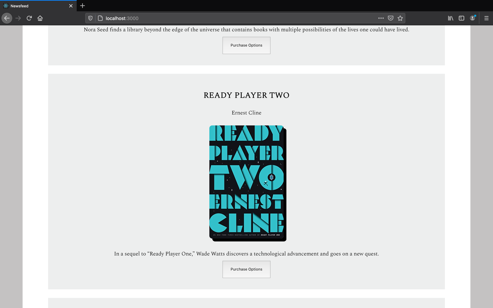

# Submission Requirements
## Project Description
# NewsFeed App Overview
NewsFeed is an application that uses the New York Times API to show the most popular news for the current day, the current week, and NYT current Bestsellers list. It is written in TypeScript and React library on the front end, and Node.js and Express server on the back-end. The application uses the MVC pattern. The view is built with React and TypeScript. Utility functions are abstracted away to utilities folder. The server consists of Controller and the Models folders. This creates separation of concerns and is scalable.

### Installation
This application requires [The New York Times API Developer key](https://developer.nytimes.com/get-started). The API key should be added to the keys.ts file in the "server" -> "src" folder as the value for NYTimesKey.
Install the dependencies both for the client and the server.
Front End Server runs with Create-React-App Server.
```sh
$ cd client
$ npm install
$ npm start
```

Back end server runs with Nodemon and Concurrently to watch for TypeScript changes.
```sh
$ cd server
$ npm install
$ npm start
```

# Front End Components

## <App/ >
- Renders the Header, NewsCollection (Main View Component) and the Footer

## <NewsCollection />
- It is the main View Component for the application
- Presents the right view (News Articles, Search Results for the News, or Best-seller Books), depending on user interaction
- Passes down data from the API to the children components (ArticleList, SearchList and BookList)
- Contains search field to search for articles


 ## <ArticleList />
- Renders article cards for the most popular news Today or for the Week, depending on user selection
- The default view is the most popular articles for the day


 ## <SearchList />
- Renders search results from the form in the NewsCollection component
- Contains a button to load more results for the same search term
- Contains Go To Top Component


 ## <BookList />
- Renders the hardcovers currently on The New York Times Bestseller List
- Has the option to sort the books based on time on bestseller list or the popularity rank
- Contains a button that presents the user a modal with the links to purchase the selected book from multiple sources



# Back End Structure
- Controller handles the Request and Response objects, passed down the data from Requests to the correct Models, gets the data from Models and responds back to the client
- Models fetch the data from the New York Times API, and pass the fetched information back to the controller


## Project Requirements
Please list examples of how your project meets the following requirements below:
- [ ] Use a modern JS Library/Framework like React, Angular, etc. We suggest using React.js.

- [ ] Create an application that can be interacted with in a minimum of three different ways by the user.

- [ ] Use of at least one Service.

- [ ] The usage of a specified architectural pattern (MVC, MVP, MVVM,  etc.)

- [ ] Use of a [REST API](https://medium.com/@arteko/the-best-way-to-use-rest-apis-in-swift-95e10696c980).
- [ ] Usage of at least 5 UI components from the [material-ui/@core](https://material-ui.com/) library (if you are not using React, a comparable UI library is acceptable)

- [ ] An example of a reusable UI component that you have created and used in the app. This should be different than the 5 UI components from the vendor library.
